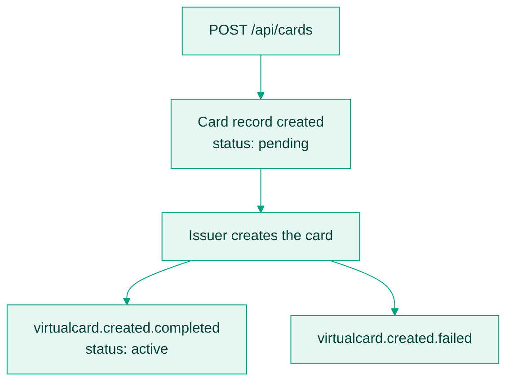

Issuing a card is one API call, but the card is created at a regulated issuing bank, not inside Bitnob. Understanding that hop explains everything about how issuance behaves: why a card starts `pending`, why the webhook is the source of truth, and why customer identity details are required up front.

## The issuance flow

Your [Create card](/api-reference/cards/create-card-embedded-customer) call returns immediately with the card in status `pending` and `created_status: processing`. The issuer then provisions the card, usually within seconds. `virtualcard.created.completed` confirms it is `active`; only then are the PAN, CVV, and expiry retrievable via [Get secure card details](/api-reference/cards/get-secure-card-details).

Treat the webhook, not the HTTP response, as the signal to show the card to a user.

## Why the customer object exists

Every card belongs to a customer, and the issuing bank requires that customer's identity: name, date of birth, ID document, and address. Two ways to satisfy it:

- **New customer**: pass the nested `customer` object on the create call; the customer and card are created together.
- **Existing customer**: pass `customer_id` and skip the object.

You remain responsible for verifying your end users before creating cards on their behalf. Bitnob enforces platform-level KYC, and higher volumes or limits can require additional cardholder verification.

## What kind of card you get

| Property | Value |
|---|---|
| Scheme | Visa |
| Form | Virtual, delivered instantly |
| Currency | USD |
| Spend scope | Online (card-not-present), plus in-store tap-to-pay via Apple or Google Wallet when contactless is enabled |
| 3DS | Not currently supported |
| Cards per customer | Up to 3 active cards |

## When to issue

| Scenario | Pattern |
|---|---|
| User wants to shop online | One general-purpose card linked to their account, reused across merchants. |
| Subscriptions | A persistent card left active for recurring charges. |
| Business spend | Per-employee or per-department cards, each with [spend limits](/api-reference/cards/update-spend-limits). |
| One-time purchase | A disposable card, terminated after use. |
| Payout-to-spend | Issue and fund a card at payout time instead of transferring fiat. |

Creating a card is not idempotent by customer: calling create twice makes two cards. Track active cards per customer in your own system, or check with [Get cards by customer](/api-reference/cards/get-cards-by-customer) before issuing.

## Common questions

<AccordionGroup>
  <Accordion title="How long does creation take?">
    Usually seconds. The card is `pending` until the issuer confirms; `virtualcard.created.completed` is the activation signal.
  </Accordion>
  <Accordion title="Can a user have multiple cards?">
    Yes, up to 3 active cards per customer at any time.
  </Accordion>
  <Accordion title="Are cards reusable?">
    Yes, until frozen, terminated, or expired. See [Freeze, unfreeze, or terminate a card](/docs/card-issuing/card-status-management).
  </Accordion>
  <Accordion title="What does creation cost?">
    A one-time fee per card, charged whether or not the card is ever funded. See [Fees and decline rules](/docs/card-issuing/card-fees).
  </Accordion>
</AccordionGroup>

Ready to build? [Issue your first card](/docs/card-issuing/issue-your-first-card) walks the whole lifecycle, and [Create card](/api-reference/cards/create-card-embedded-customer) has the full request schema.
