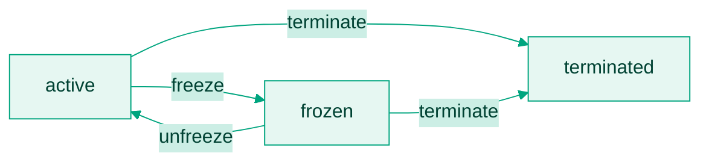

Every card is in one of three states, and the transitions are one-way in a single place:



Freezing is reversible. Termination is not.

## What each state allows

| State | New authorisations | Funding | Settlements of prior auths | Refunds and reversals |
|---|---|---|---|---|
| `active` | Yes | Yes | Yes | To the card |
| `frozen` | No | No | Yes | To the card |
| `terminated` | No, auto-declined | No | No | To your master balance |

A card becomes `active` when creation completes, and again when unfrozen. A `terminated` card stays visible in transaction history for audit and disputes.

## Freeze and unfreeze

Both go through [Freeze or unfreeze](/api-reference/cards/freeze-or-unfreeze):

```http
POST /api/cards/{cardId}/status
{ "status": "frozen" }
```

```http
POST /api/cards/{cardId}/status
{ "status": "active" }
```

Expose freeze in your UI: it is the single most-wanted control when a cardholder sees a charge they do not recognise, and it works instantly.

Bitnob also freezes cards automatically:

| Trigger | Detail |
|---|---|
| Fraud suspicion | Abnormal usage patterns, unusual merchant activity, or velocity violations. |
| Unauthorised refund | A refund arrives from a merchant the card never spent at, for example a \$20 AliExpress refund on a card that never paid AliExpress. |

An automatic freeze surfaces as the `virtualcard.transaction.declined.frozen` webhook on the next authorisation attempt. Cards frozen for fraud may need compliance review before they can be unfrozen.

## Terminate

```http
DELETE /api/cards/{cardId}
{ "reason": "Card no longer needed" }
```

[Terminate card](/api-reference/cards/terminate-card) permanently deactivates the card and sweeps any remaining balance back to your wallet, reported as `virtualcard.terminated.refund`. Two constraints:

<Warning>
  Termination is irreversible, and a card cannot be terminated within 24 hours of creation. A cardholder who needs to keep transacting gets a new card; never try to revive a terminated one.
</Warning>

Bitnob terminates cards automatically on:

| Trigger | Detail |
|---|---|
| Confirmed fraud | Flagged behaviour confirmed as high-risk or abusive. |
| Repeated decline violations | The third decline-rule violation terminates the card after the fee is charged. See [Fees and decline rules](/docs/card-issuing/card-fees). |
| Usage violations | Attempts on blocked MCCs or unsupported countries. |

Auto-termination surfaces as `virtualcard.transaction.declined.terminated`.

## React to the status webhooks

| Event | Meaning | Do this |
|---|---|---|
| `virtualcard.transaction.declined.frozen` | A charge was declined because the card is frozen. | Tell the user, offer unfreeze or support. |
| `virtualcard.transaction.declined.terminated` | A charge was attempted on a terminated card. | Prompt the user to create a new card. |
| `virtualcard.terminated.refund` | Terminated card's balance was refunded. | Reconcile the credit to your wallet. |

Payloads are on [Webhook events](/docs/card-issuing/webhooks). In your UI: show status clearly, grey out terminated cards but keep their history visible, and route users from a terminated card straight into issuing a replacement.
