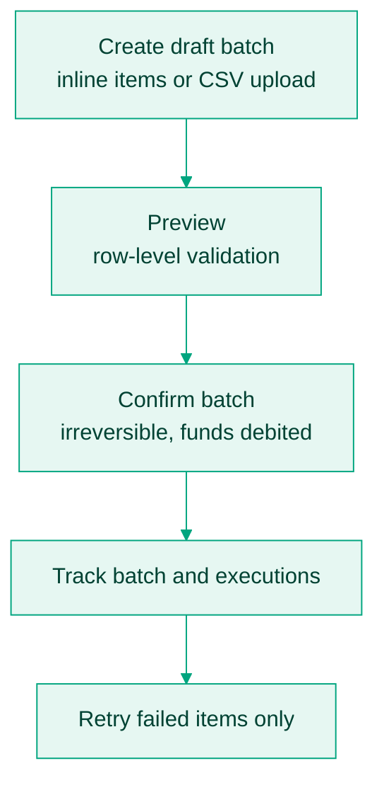

There are two different bulk problems, and Bitnob solves them differently:

- **Many fiat payouts** (payroll to bank accounts, mobile money disbursements): there is no batch payout endpoint. You loop the single quote → initialize → finalize flow, and the discipline is in your references and error isolation.
- **Many crypto transfers** (paying wallets across chains): use the [Bulk transfers API](/api-reference/bulk-transfers/create-draft-batch), which takes a list or a CSV, validates it row by row, and executes as a batch.

## Fiat payouts at volume

Each payout is its own quote, its own funding, and its own lifecycle. Run them concurrently, but keep three rules:

1. **One unique `reference` per payout, generated by you.** This is your idempotency key: if your job crashes mid-batch, sweep [List payouts](/api-reference/payouts/list-payouts) for your references before re-submitting anything, and skip the ones that already exist.
2. **Isolate failures.** One rejected beneficiary must not stop the loop. Collect failures, let the rest settle, and retry the failures separately after [validating the beneficiary](/docs/payouts/validate-a-beneficiary).
3. **Respect quote expiry per payout.** Every quote has its own short `expires_at`. Quote and fund each payout as you process it rather than quoting the whole batch upfront; rates locked at the start of a long run will expire before the tail is funded.

Watch the four [webhook events](/docs/payouts/statuses-and-webhook-events) per payout, and reconcile the batch by sweeping [List payouts](/api-reference/payouts/list-payouts) at the end, since `FAILED` emits no event.

If you fund offchain, check your balance covers the whole batch before starting, with [List balances](/api-reference/balances/list-balances). A batch that runs out of balance halfway is the worst version of a partial failure.

## Crypto disbursements: the bulk transfers API

For paying many wallet addresses, the platform has a purpose-built batch flow: draft → preview → confirm, with per-row validation before anything is debited.



<Steps>
  <Step title="Create a draft">
    Inline, with [Create draft batch](/api-reference/bulk-transfers/create-draft-batch):

    ```json
    {
      "description": "March payroll batch",
      "items": [
        {
          "row_index": 1,
          "chain": "ethereum",
          "currency": "USDT",
          "address": "0xd0438C776d03df4FCfF69db78B97e2E6B5Cf033b",
          "amount": "1",
          "description": "payout"
        }
      ]
    }
    ```

    Amounts are in base units. For large batches, upload a CSV instead: [Get upload URL](/api-reference/bulk-transfers/get-upload-url-s3-presigned) returns a presigned URL, upload the file, then run [Preview uploaded file](/api-reference/bulk-transfers/preview-uploaded-file) with the returned `upload_id`.
  </Step>
  <Step title="Preview and fix rows">
    The preview validates every row and returns per-row status before anything moves. Fix rejected rows in the source and re-upload; do not confirm a batch with rows you have not seen validated.
  </Step>
  <Step title="Confirm">
    [Confirm batch](/api-reference/bulk-transfers/confirm-batch) promotes the draft to execution. This is irreversible and debits funds.
  </Step>
  <Step title="Track and retry">
    [Get batch](/api-reference/bulk-transfers/get-batch) shows batch state; failed items are retried individually with [Retry failed items](/api-reference/bulk-transfers/retry-failed-items), so one bad row never means re-running the batch.
  </Step>
</Steps>

Recurring runs, such as weekly payroll, can be scheduled from a template batch with [Create schedule](/api-reference/bulk-transfers/create-schedule).
