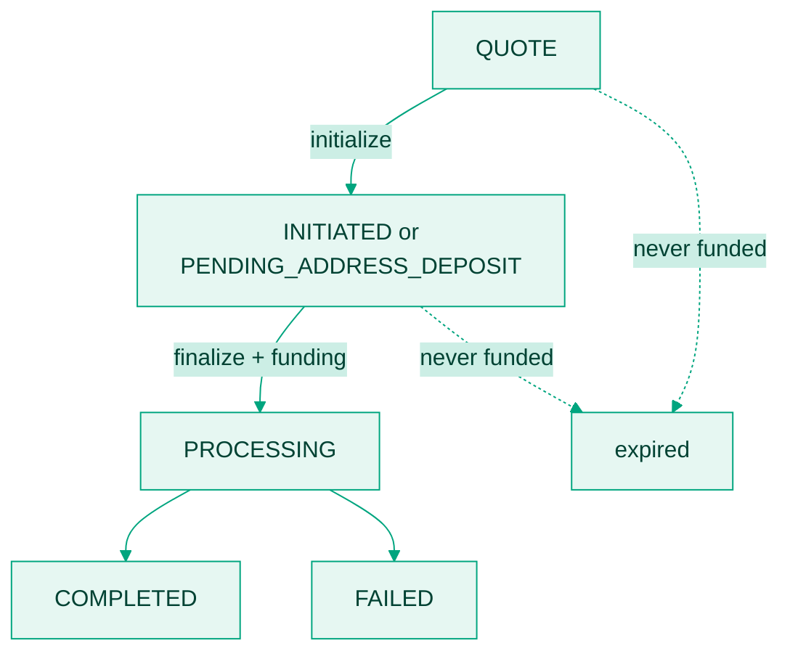

A payout is not a single API call. It is a record that moves through states, and your integration has to handle each one. Two states are terminal.

Only four transitions emit a webhook. The rest you observe by polling [Get payout](/api-reference/payouts/get-payout). Treating the absence of a webhook as the absence of progress is the most common integration mistake.

The full status and event tables live on [Statuses and webhook events](/docs/payouts/statuses-and-webhook-events). This page explains what happens between them.

## Quote

Call [Create quote](/api-reference/payouts/create-quote). Bitnob returns the record in status `QUOTE` with a `quote_id`, the amount to fund, the FX rate, and an `expires_at` timestamp.

<Warning>
  Every quote carries an `expires_at` timestamp, and the window is short, minutes rather than hours. Read it from the response rather than assuming a fixed duration. After expiry the rate is void and you must request a new quote.
</Warning>

## Initialize

Call [Initialize payout](/api-reference/payouts/initialize-payout) with the quote ID and the beneficiary details. This locks the quote and attaches the recipient. What comes back depends on your funding source:

- **Offchain** (funded from your balance): the record moves to `INITIATED`. Nothing is debited yet.
- **Onchain** (funded per transaction): the record moves to `PENDING_ADDRESS_DEPOSIT` and the response carries an `address`, the Bitcoin address, Lightning invoice, or stablecoin deposit address to pay.

The `payouts.initialized` event fires here. Nothing has settled; Bitnob is waiting to be funded.

## Finalize

Call [Finalize payout](/api-reference/payouts/finalize-payout) with no request body. This commits the payout:

- **Offchain**: your balance is debited now, and the payout proceeds to settlement.
- **Onchain**: the payout waits for your deposit. Pay the `address` from the initialize response before `expires_at`.

## Funding confirmation (onchain only)

Bitnob detects the incoming payment, then waits for it to confirm. No webhook fires during this window; poll [Get payout](/api-reference/payouts/get-payout) if you need to show funding progress.

Two cases to handle:

- **Underpayment.** The payout amount is adjusted down proportionally.
- **Late payment.** Funds that arrive after `expires_at` may leave the payout cancelled and needing manual reconciliation.

## Processing

Once funded, the record moves to `PROCESSING` and Bitnob dispatches the fiat leg to the local rail. `payouts.processing` fires when the rail accepts it.

How long this takes depends on the destination rail. NIP settles in seconds; SEPA and ACH settle in hours or days. See [Supported currencies and rails](/docs/payouts/supported-currencies).

Invalid beneficiary details fail here rather than earlier, because the local bank is the first party to validate them. [Validate the beneficiary](/docs/payouts/validate-a-beneficiary) before initializing to catch this in advance.

## Completed or failed

| Outcome | Record status | Webhook |
|---|---|---|
| Funds delivered | `COMPLETED` | `payouts.withdrawal.success` |
| Fiat leg failed | `FAILED` | none, poll [Get payout](/api-reference/payouts/get-payout) |
| Never funded before expiry | stays `QUOTE` / `PENDING_ADDRESS_DEPOSIT` | `payouts.withdrawal.expired` |

Treat `COMPLETED` as the only success state, and confirm it with a lookup rather than assuming it from the finalize response.

Failure does not emit a webhook. If you only act on webhooks, a failed payout sits in your system as permanently processing. Reconcile against [Get payout](/api-reference/payouts/get-payout) on a schedule.

## Next

- [Send your first payout](/docs/payouts/send-your-first-payout) walks the whole flow with real requests and responses.
- [Handle payout failures](/docs/payouts/error-handling) covers each failure scenario and how to respond.
- [Receive payout webhooks](/docs/payouts/webhook-payout) covers verification and the event payloads.
