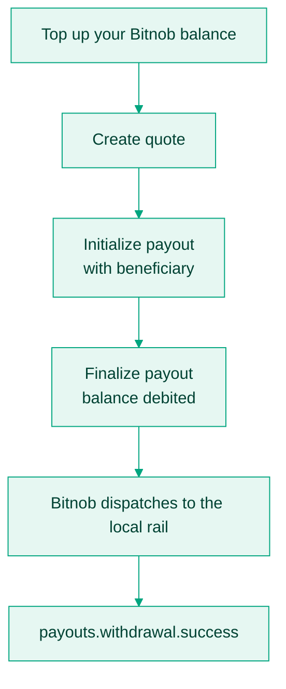
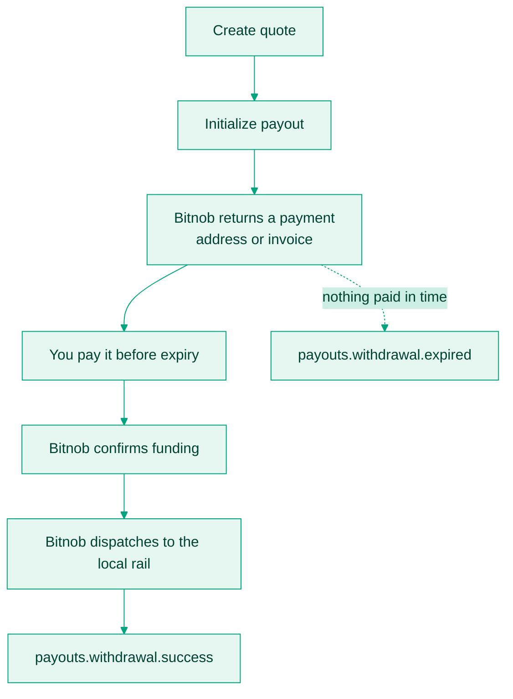

Bitnob funds payouts two ways. The difference is whether you hold a balance in advance or pay for each payout as you create it.

| Model | How it funds | Suits |
|---|---|---|
| Wallet-funded | Deducted from a balance you top up in advance. | High volume, and teams that already manage float. |
| On the fly | Each payout is funded individually by paying a generated address or invoice. | Lower volume, and teams that would rather not hold idle balances. |

Both models reach every supported country and channel. Both can run side by side in the same account.

## Wallet-funded

You top up your Bitnob balance with bitcoin, USDT, USDC, or a supported local currency. Each payout debits that balance.

1. Top up the balance. Check it with [List balances](/api-reference/balances/list-balances).
2. Create a quote, initialize with the beneficiary, then finalize. The amount is debited at finalize.
3. Bitnob validates compliance and liquidity, then dispatches to the rail.

Payouts execute as soon as validation passes, so there is no funding wait and no quote expiry to race. The cost is that you carry float, and a payout fails if the balance is short.

## On the fly

You hold no balance. Each payout generates its own payment address or invoice, which you pay before the payout settles.

1. Call [Create quote](/api-reference/payouts/create-quote). You get a quote ID, the amount to fund, and an expiry timestamp.
2. Call [Initialize payout](/api-reference/payouts/initialize-payout) with the quote ID and beneficiary details. Bitnob returns a Bitcoin, Lightning, or stablecoin payment destination, depending on whether you selected `ONCHAIN` or `OFFCHAIN`.
3. Pay it before the quote expires.
4. Bitnob confirms receipt, then dispatches the fiat payout.
5. `payouts.withdrawal.success` or `payouts.withdrawal.expired` tells you the outcome.

No float, and reconciliation is one payment per payout. The cost is that every payout has a funding deadline you have to meet.

### Funding sources

| Source | Notes |
|---|---|
| Bitcoin (BTC) | Pay the exact BTC amount quoted, on-chain or over Lightning. |
| USDT | Pay the exact amount on a supported chain. |
| USDC | Pay the exact amount on a supported chain. |

### Things that will bite you

| Case | Behaviour |
|---|---|
| Quote expiry | Every quote carries an `expires_at` timestamp, and the window is short, minutes rather than hours. After expiry, request a new quote at the current rate. |
| Underpayment | The payout amount is adjusted down proportionally rather than rejected. |
| Overpayment | The excess is credited to your Bitnob balance. |
| Timeout | If nothing arrives before expiry, the payout is invalidated and `payouts.withdrawal.expired` fires. |

## Choosing

Pick wallet-funded if payout volume is steady enough that holding float costs less than the operational overhead of per-payout funding, or if you cannot tolerate a funding step between the user's request and settlement.

Pick on the fly if volume is low or spiky, if you are still in early integration, or if idle balance is the thing you are trying to avoid.

The models are not exclusive. A common pattern is wallet-funded for recurring payroll and on the fly for one-off disbursements.
