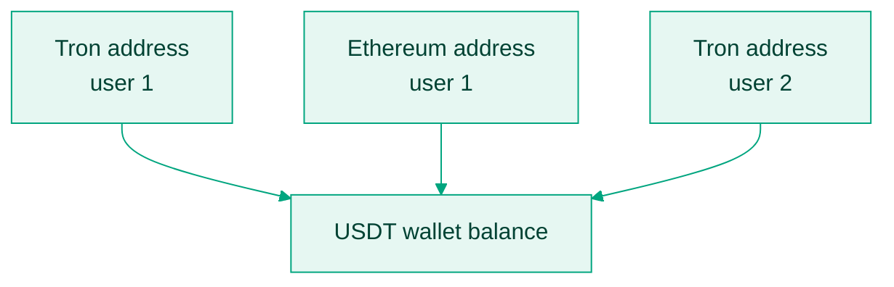

Four ideas explain everything the stablecoin API does. Internalise them and the individual endpoints become predictable.

## One API across every chain

Stablecoins live on many blockchains with different token standards, fee markets, and confirmation rules. Your integration should not have to care. You pass a `chain` parameter, and the request shape, webhooks, and status vocabulary stay the same whether the transfer rides Tron or Ethereum.

The live chain list, per-chain tokens, and decimals come from [Supported chains](/api-reference/addresses/supported-chains); the docs-side matrix is on [Supported chains](/docs/stablecoins/supported-chains).

## Wallets are ledgers, addresses are doors

A **wallet** is Bitnob's internal ledger object tracking how much USDT or USDC you control. A **deposit address** is an on-chain address issued against that wallet, specific to one chain and used to attribute incoming funds.

One wallet can stand behind many addresses. A typical setup issues each customer a Tron address for low-fee inflows and an Ethereum address for DeFi-adjacent ones; both credit the same balance, readable with [List balances](/api-reference/balances/list-balances).

## Crediting waits for confirmations

Each chain needs a different number of confirmations before a transaction is safe to treat as final; Bitnob enforces those thresholds and only fires `deposit.success` once they are met. The per-chain thresholds are on [Supported chains](/docs/stablecoins/supported-chains).

Two consequences for your product:

- Credit users from the webhook, never from first detection. A transaction visible on an explorer is not yet spendable.
- Show progress. The webhook flow supports "pending, n confirmations" states, which turn an opaque wait into a understandable one.

Finality differs too: Solana and Avalanche are absolute at one confirmation, while Ethereum-family chains are probabilistic, which is why rare reorgs exist and why reconciliation matters at scale. See [Reconcile balances](/docs/stablecoins/stablecoin-reconciliation-and-ledger-integrity-guide).

## Writes are idempotent, operations are atomic

Every state-changing call carries a unique `reference` you generate. Submitting the same reference again returns the original result instead of repeating the action, which makes retries after timeouts safe.

Operations are also atomic: if a send fails on-chain, your balance is not debited; you never see a success status unless every backend step succeeded. The events that carry those outcomes, `deposit.success`, `transfer.success`, and `transfer.failed`, are the primary trigger for balance updates in your system, with polling [List transactions](/api-reference/transactions/list-transactions) as the failsafe. See [Receive stablecoin webhooks](/docs/stablecoins/webhooks).
