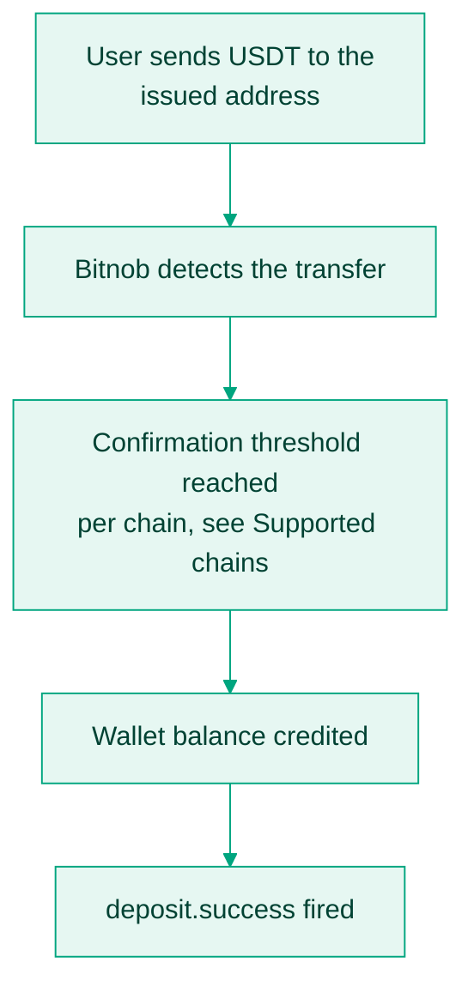

Once you have [issued a deposit address](/docs/stablecoins/issuing-stablecoin-addresses), Bitnob monitors it on-chain. When a transfer is detected and passes the chain's confirmation threshold, your wallet balance is credited and `deposit.success` fires. That event is your signal to credit the user.



<Note>
  Deposits below $1 are not processed. Confirmation thresholds differ per chain, from 1 on Solana to 128 on Polygon; the full table is on [Supported chains](/docs/stablecoins/supported-chains).
</Note>

## Act on deposit.success

The payload carries everything needed to credit and reconcile; [verify the signature](/api-reference/addresses/webhooks#verifying-events) first, then match on `address` and record `hash` as the on-chain proof.

```json
{
  "event": "deposit.success",
  "event_id": "944a4089-6065-49ca-8f43-fb10f15c59e6",
  "data": {
    "address": "6AtXPbFNrvg6ZiG4g1j3p8Z7mkpqjtdT2jC5siQC5dqM",
    "amount": "1100000",
    "chain": "solana",
    "currency": "USDC",
    "fee": "0",
    "hash": "3TfBAvqrGBHvHMVzrGMfNbyPZ3Lb1oWYfKtYgzq2qvBDa1DzskqY9V7YgtyUeyb5aA9F4hgPBm3Hp1VpLJMgchYx",
    "reference": "RCV_USDC_d4f075577f6e",
    "timestamp": "2026-05-15T12:03:45Z",
    "transaction_id": "3ac20197-f0c7-4553-ac32-9ead17c7f0a9"
  }
}
```

`amount` is in the token's smallest unit, 6 decimals, so `1100000` is 1.10 USDC. Field-by-field documentation is under [the deposit webhook reference](/api-reference/addresses/webhooks#webhook), and the credited balance is visible in [List balances](/api-reference/balances/list-balances).

## Let users pick a network

[Supported chains](/api-reference/addresses/supported-chains) returns the live chain list with tokens and decimals. Use it to render a network selector, steer users toward low-fee chains for small amounts, and refuse a chain before issuing an address for it. In sandbox, fund test deposits from [Circle's faucet](https://faucet.circle.com).

## Edge cases that show up at volume

<AccordionGroup>
  <Accordion title="Duplicate transfers">
    A user sends the same amount from the same wallet twice. `address + chain + currency + hash` is the unique deposit identity; de-duplicate on it, not on amount.
  </Accordion>
  <Accordion title="Late reorgs">
    Rare, and mostly on probabilistic-finality chains: a block reorganisation can invalidate a previously seen transaction. Bitnob's confirmation thresholds exist to absorb this, and reconciliation catches the remainder; see [Reconcile balances](/docs/stablecoins/stablecoin-reconciliation-and-ledger-integrity-guide).
  </Accordion>
  <Accordion title="Wrong-chain deposits">
    A user sends USDT over Ethereum to a Tron address. These funds are not recoverable. Prevent them in your UI: make the selected network explicit, warn on mismatch, and encode chain metadata in QR codes where you show them.
  </Accordion>
  <Accordion title="Missed webhooks">
    Deliveries retry, but your backstop is polling [List transactions](/api-reference/transactions/list-transactions) on a schedule and backfilling anything your handler missed.
  </Accordion>
</AccordionGroup>
