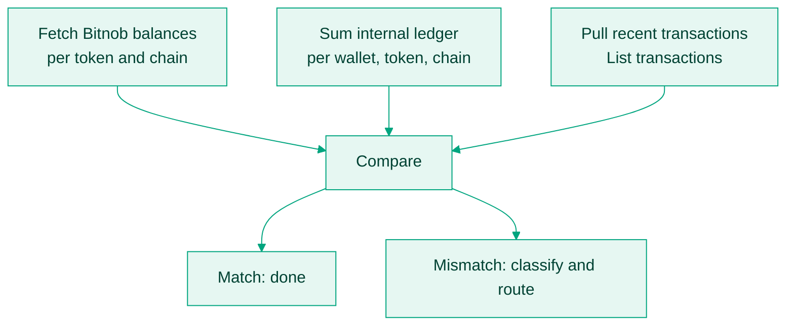

Three views of the same money exist in a stablecoin system: what your ledger says, what [Bitnob's balances](/api-reference/balances/list-balances) say, and what the chain shows. They drift for mundane reasons, a missed webhook, a transfer marked done that reverted, a deposit with no customer mapping, and one unnoticed mismatch compounds. Reconciliation is the job that keeps the three in agreement.

## Ledger rules that make reconciliation possible

- Record every deposit and withdrawal with `reference`, `hash`, `chain`, `currency`, wallet, timestamp, and source.
- Credit a deposit only on `deposit.success`; debit a withdrawal only after the API accepted it **and** `transfer.success` arrived.
- Log every received webhook in its own event log, with processing outcome. Missed webhooks are the leading cause of drift, and the log is how you prove and repair it.
- Map every Bitnob event to exactly one ledger action. Duplicates are de-duplicated on `event_id`, and on `hash` for deposits.

## The daily job

Inputs: [List balances](/api-reference/balances/list-balances) (or [Get balance by currency](/api-reference/balances/get-balance-by-currency) per asset), your ledger sums, and recent activity from [List transactions](/api-reference/transactions/list-transactions).

| Finding | Response |
|---|---|
| Balance mismatch, Bitnob vs ledger | Log the diff, hunt the missing transaction. |
| Webhook received but never processed | Backfill the ledger from your event log. |
| Transfer shown successful that failed | Reverse the ledger entry, notify support. |
| Transfer pending beyond the chain's expected window | Mark stuck, escalate; do not re-send. |
| On-chain deposit with no wallet mapping | Park in a holding wallet, attribute manually. |

Classify every mismatch as pending investigation, resolved, or false positive, so the queue trends to zero instead of accumulating.

## Backfilling missed webhooks

Delivery is at-least-once, so both directions need handling: de-duplicate what arrives twice, and backfill what never arrives. Sweep [List transactions](/api-reference/transactions/list-transactions) on a schedule, diff against your event log, and re-resolve anything unmatched with [Get transaction by id](/api-reference/transactions/get-transaction-by-id).

Credit a customer only when `deposit.success` was received, or your own poll of the transaction shows the chain's confirmation threshold met; the thresholds are on [Supported chains](/docs/stablecoins/supported-chains).

## Tooling worth building for ops

- Webhook replay by reference or hash.
- A ledger explorer filterable by wallet, token, chain, date, and discrepancy.
- A restricted manual credit and debit override, logged.
- CSV export for finance audits.

## Golden rules

1. Webhook-driven, with polling as the failsafe, never the design.
2. The reconciled ledger is the truth; the UI shows nothing as completed that is not reconciled.
3. Every event maps to one ledger action, exactly once.
