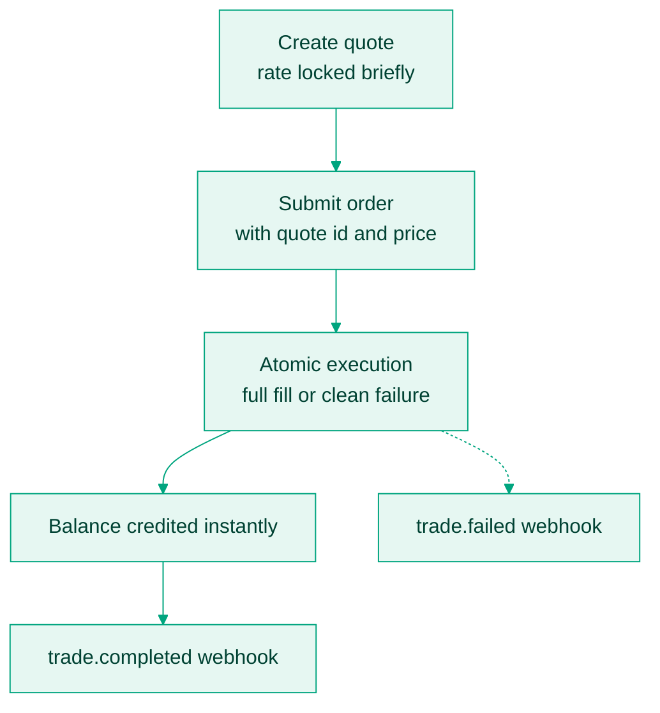

Behind the two API calls sits a routing engine: price discovery across centralized exchanges and OTC desks, quote generation with optional locking, atomic execution, and instant wallet settlement. You never touch order books, slippage management, or venue routing; you quote, execute, and confirm.

## Prices come from routing, not a feed

The `price` on a quote reflects live pricing across venues, routing optimised for reliability and capital efficiency, and any margin configuration on your tier. Treat the quote as the truth for pricing: never reconstruct or cache a rate beyond its `expires_at`. For an indicative rate with no execution promise, read [List all prices](/api-reference/trading/list-all-prices) instead.

## Market rate or locked quote

| Mode | Behaviour |
|---|---|
| Locked quote | Fetch a [quote](/docs/trading/create-quote) first, execute with its `id` and `price`. The user gets exactly the rate shown. |
| Market rate | Submit the order without a `quote_id`. Executes at the best current rate; the output can vary slightly. |

Lock the quote whenever a user sees a rate before confirming, whenever you promise a fixed price, and always for NGN pairs, where a `quote_id` is mandatory. Quotes expire fast, roughly 30 seconds in development and 10 in production, so drive a visible countdown from `expires_at` and disable the confirm action when it passes.

## What atomic execution buys you

An order fills completely or fails cleanly; there is no partial state. If the quote expired, the balance is short, or execution errors, no funds move and you get a clean error. Consequently:

- Never debit a user before `trade.completed` arrives.
- A failed trade needs no cleanup, only a fresh quote.
- Retrying with the same `reference` is safe: it returns the original result instead of trading twice.

## Amounts and rates

Requests take `quantity` in major units of the base currency: `"0.0001"` BTC, `"10"` USDT, `"5000"` for ₦5,000. The quoted `price` is per unit of base currency in the quote currency, and the `exchange` block on every quote spells out exactly what you send and receive, so display from it rather than computing your own conversion.

## Common questions

<AccordionGroup>
  <Accordion title="Why do quotes expire so quickly?">
    Markets move. A quote that stayed valid would let callers exploit price changes at Bitnob's expense, so each one carries a short `expires_at`. Executing after expiry fails cleanly with `Quote expired`; fetch a fresh quote. For display-only pricing with no expiry, use [List all prices](/api-reference/trading/list-all-prices).
  </Accordion>
  <Accordion title="What is a spread, and can I add my own?">
    The spread is the difference between the rate a user gets and the market rate, and it is how trading platforms earn. You can pass Bitnob's rate through untouched or apply your own markup on top before showing it; the quote's rate is the executable floor.
  </Accordion>
  <Accordion title="How are prices determined?">
    From centralized exchanges, OTC desks, and internal routing. You do not manage any of it; the quote you receive is trusted and executable, and your system receives the promised output or nothing.
  </Accordion>
  <Accordion title="Can I fetch quotes without trading?">
    Yes, quotes are free and non-committal. Build pricing calculators or remittance previews on them, and cache no longer than `expires_at`.
  </Accordion>
  <Accordion title="What happens during execution?">
    Quote validation, balance check, execution, credit to the destination balance, then the `trade.completed` event. Any failure along the way moves no funds.
  </Accordion>
  <Accordion title="What am I responsible for as an integrator?">
    Unique `reference` per trade, no execution of expired quotes, webhook-driven state rather than trusting the synchronous response, and reconciliation of trades against balances. See [Handle trading failures](/docs/trading/error-handling-patterns).
  </Accordion>
</AccordionGroup>

## A complete sell flow

A user holds 100,000 sats and wants stablecoins:

1. [Create a quote](/api-reference/trading/create-quote) for the BTC → USDT pair.
2. Show "You'll receive \$45.12" with a countdown from `expires_at`.
3. On confirmation, [submit the order](/api-reference/trading/submit-order) with the quote `id`, `price`, and your `reference`.
4. On `trade.completed`, credit your ledger and show success.
5. Optionally continue into a [payout](/docs/payouts/overview) to a bank or mobile money account.
