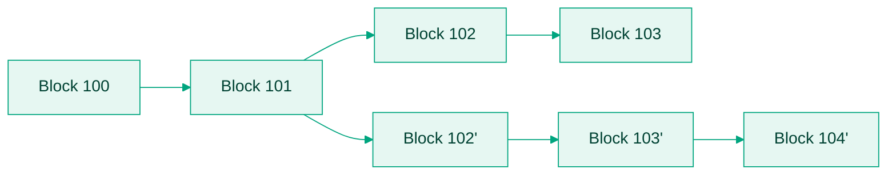

## 5.1 Introduction

In Bitcoin, payment finality is probabilistic , meaning a transaction becomes more final as more blocks are mined on top of it but is never 100% final immediately.

This is a critical concept for both wallet design and user education.

Understanding confirmations and block reorganizations (reorgs) is essential for:

1. Designing secure user experiences (especially for merchants, exchanges, remittances).
2. Explaining why Bitcoin transactions are not “instant" even when broadcast.
3. Protecting users from rare but catastrophic edge cases.

## 5.2 What is a confirmation?

When a user sends bitcoin:

- Their transaction first enters the mempool (the pool of unconfirmed transactions waiting to be mined).
- Miners pick transactions from the mempool to include in the next block, prioritizing higher-fee transactions.
- Once a transaction is included in a mined block, it has 1 confirmation.
- Each subsequent block built on top of that block adds another confirmation.

Confirmations represent how deeply buried a transaction is inside the blockchain history.

The deeper the transaction is buried, the harder it becomes to reverse or reorganize.

## 5.3 Confirmation timeline example

Scenario:

1. Ngozi in Abuja sends 0.3 BTC to Wanjiku in Nairobi.
2. Ngozi’s transaction is broadcast to the network.
3. The transaction appears in the mempool.
4. After 9 minutes, a miner includes the transaction in a block.

Now:

1. 1 block mined → Transaction has 1 confirmation.
2. 2 blocks mined → Transaction has 2 confirmations.
3. 6 blocks mined → Transaction has 6 confirmations (high security).

## 5.4 Why multiple confirmations are recommended

Because of the way Bitcoin’s consensus works:

- Blocks are built independently by miners.
- It is possible (though rare) that two miners find a valid block at almost the same time.
- This creates a temporary chain split.
- Nodes follow the longest chain rule, the chain with the most accumulated proof-of-work wins.

If a competing chain grows faster, transactions in the "losing" chain may get replaced or reorganized. Meaning transactions once considered "confirmed" might disappear.

## 5.5 Block reorganization (reorg) explained

A block reorg happens when:

- Two different versions of the blockchain exist temporarily.
- Nodes switch to a longer chain that excludes certain previously confirmed blocks.
- Transactions in orphaned blocks go back to the mempool. They become unconfirmed again.

Two branches compete from block 101 onward.

- If the competing branch grows longer (more accumulated work) → Block 102 and Block 103 are orphaned
- Transactions from orphaned blocks return to the mempool and are re-mined; they are only lost if deliberately double-spent.

## 5.6 How common are reorgs?

- 1-block reorgs happen occasionally (roughly once every week or two on Bitcoin).
- 2-block reorgs are rare.
- 3+ block reorgs are extremely rare on Bitcoin mainnet.

Bitcoin’s mining power distribution, economic incentives, and node behavior make deep reorgs extremely unlikely without massive coordinated attacks.

<Info>
  However, wallets must still account for the real-world possibility of reorgs, especially if handling large payments.
</Info>

## 5.7 Industry standards for confirmations

| Use Case | Typical Confirmation Requirement |
|---|---|
| Small Retail Payments | 0–1 confirmation (Accept risk of reorg for speed ) |
| Exchanges Deposits | 3–6 confirmations (Standard security balance ) |
| Large Enterprise Settlements | 6+ confirmations (Maximum caution against reversal) |

**Note:** Risk tolerance depends on:

- Amount of bitcoin being moved
- Risk profile of the business
- How critical finality is

## 5.8 PM reflection points: Building wallet UX

If you are designing a Bitcoin wallet:

1. Explain confirmations to users.

   Always show transaction status:

   - Unconfirmed (0 confirmations)
   - Confirming (1–5 confirmations)
   - Finalized (6+ confirmations)

2. Do not instantly mark funds as fully available after 0 confirmations unless you are willing to accept the risk of reorgs.

3. Allow flexibility:

   Developers should set different confirmation thresholds for different flows:

   - Fast micropayments may accept 0–1 confirmation.
   - Custody services may require 6 confirmations or more.

4. Handle reorg gracefully:

   If a transaction gets dropped from a block, wallets should:

   - Update transaction status to unconfirmed.
   - Notify users without causing panic.
   - Re-broadcast if necessary.

## 5.9 Practical real-world example

Ada is running a Bitcoin payment app in Lagos.

She receives a 0.01 BTC payment from a customer at her café.

Because it’s a small amount:

Ada accepts the transaction after 0 confirmations, relying on network honesty.

If she were running a Bitcoin exchange, she would instead wait for 3–6 confirmations before crediting a customer deposit.

**Key takeaway:** Product decisions must adapt confirmation policies to the use case.

## 5.10 Summary of module 5

- Bitcoin confirmation is a process, not an instant event.
- 1 confirmation = included in one block (good, but still reversible under rare conditions).
- 6 confirmations = considered extremely secure (virtually irreversible under Bitcoin’s current security model).
- Block reorganizations are real but rare.

Wallets must:

- Track confirmation depth properly.
- Handle reorgs intelligently.
- Set clear user expectations around confirmation times and payment finality.

## Module 5 complete

We now fully understand how Bitcoin transactions move from broadcast to confirmed to finalized,

and why confirmations, mempool status, and reorg risk are core wallet UX realities, not just engineering backend details.